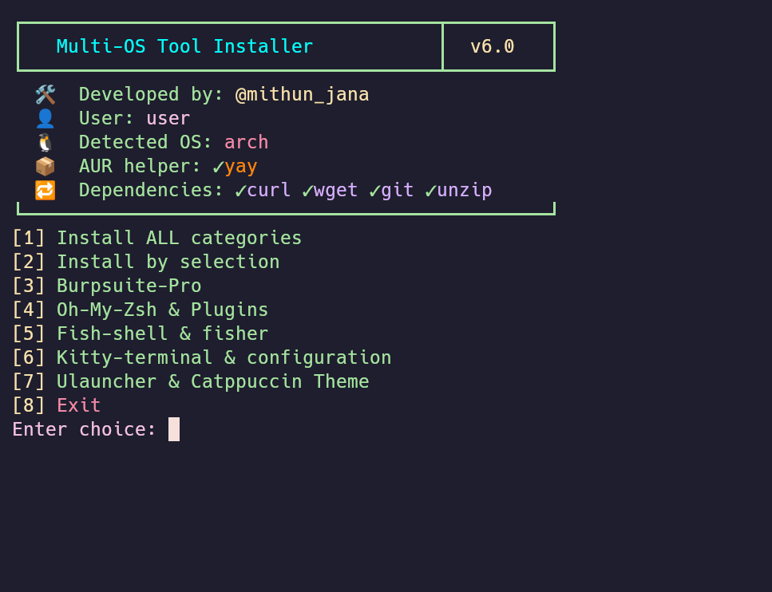
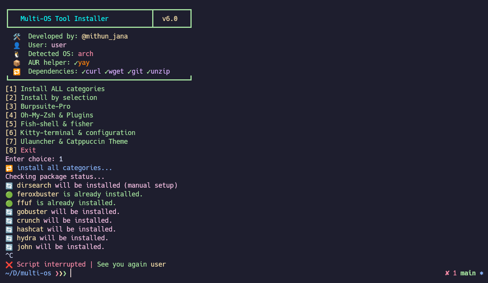
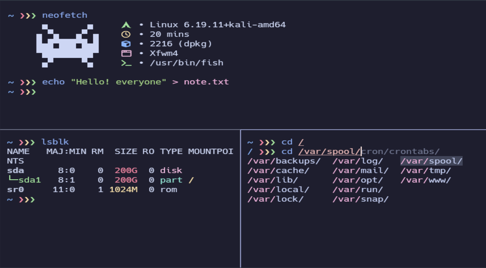

<div align="center">

# 🛠️ Multi-OS Security Tool Installer
### `multi-os-v6.0`

[](https://github.com/mithun_jana)
[](https://www.gnu.org/software/bash/)
[](https://www.linux.org/)
[](LICENSE)

> **One script. Two distros. Full pentesting lab in minutes.**  
> Automates setup of 60+ security tools, terminal ricing, and shell configuration across Arch Linux and Debian-based systems (Kali, Parrot, Ubuntu).

</div>

---
## 📸 Screenshots

### Interface

### installation

### Fish Shell with kitty

## 📋 Table of Contents

- [Features](#-features)
- [Supported Systems](#-supported-systems)
- [Quick Start](#-quick-start)
- [Menu Overview](#-menu-overview)
- [Tool Categories](#-tool-categories)
- [What Gets Configured](#-what-gets-configured)
- [Requirements](#-requirements)
- [How It Works](#-how-it-works)
- [Screenshots](#-screenshots)
- [Notes](#-notes)
- [Author](#-author)

---

## ✨ Features

- 🤖 **Auto OS Detection** — Automatically detects Arch, Kali, Parrot, or Debian and picks the right package manager and install method
- 📦 **Smart Install Checks** — Never reinstalls a tool that already exists; idempotent by design
- 🎯 **Flexible Selection** — Install everything at once, pick entire categories by letter, or cherry-pick individual tools by number — even mix them (`a,15,23`)
- 🔄 **AUR Support** — Auto-installs `yay` on Arch and uses it for AUR packages seamlessly
- 🔧 **Manual Fallbacks** — Tools not in official repos (feroxbuster, rustscan, amass, etc.) are fetched directly from GitHub releases
- 🎨 **Terminal Ricing** — Installs and fully configures Kitty terminal + Catppuccin + Hack Nerd Font + Fish/Zsh
- 🐟 **Fish Shell Setup** — Installs fisher, plugins, grc color aliases, ZSH history migration, and sets fish as default shell
- 🐚 **Oh-My-Zsh Setup** — Installs with autosuggestions, fast-syntax-highlighting, and autocomplete plugins
- 🚀 **Ulauncher + Catppuccin** — Installs Ulauncher app launcher with full Catppuccin theme and autostart
- 🛡️ **BurpSuite Pro** — Two install modes: stable (JAR + loader) and latest (native installer), both with version comparison and upgrade support
- 🔊 **Sound Fixes** — Applies WirePlumber/PipeWire config to fix audio latency issues common in VMs
- 💻 **VMware Tools** — Auto-enables `open-vm-tools` and `vmtoolsd` for guest VM environments
- 📝 **Colorized Logging** — All output is color-coded with emoji indicators (✅ 🔴 ⬇️ 💡) and written to `/tmp/tool_installer.log`
- 🔒 **Interrupt Safe** — Handles `Ctrl+C` gracefully with a clean exit message and temp file cleanup

---

## 🐧 Supported Systems

| OS | Status | Package Manager |
|---|---|---|
| Arch Linux | ✅ Full support | `pacman` + `yay` (AUR) |
| Kali Linux | ✅ Full support | `apt` |
| Parrot OS | ✅ Full support | `apt` |
| Debian / Ubuntu | ✅ Full support | `apt` |

---

## ⚡ Quick Start

```bash
# 1. Clone the repo
git clone https://github.com/mithunjana0051/multi-os.git
cd multi-os

# 2. Make executable
chmod +x multi-os-v6.0.sh

# 3. Run
./multi-os-v6.0.sh
```

> ⚠️ **Run as a regular user with sudo access** — do NOT run as root directly.

---

## 🗂️ Menu Overview

```
┏━━━━━━━━━━━━━━━━━━━━━━━━━━━━━━━━━━━━━┳━━━━━━━━━┓
┃   Multi-OS Tool Installer           ┃  v6.0   ┃
┗━━━━━━━━━━━━━━━━━━━━━━━━━━━━━━━━━━━━━┻━━━━━━━━━┛

[1] Install ALL categories
[2] Install by selection
[3] Burpsuite-Pro (latest)
[4] Burpsuite-Pro (stable)
[5] Oh-My-Zsh & Plugins
[6] Fish-shell & fisher
[7] Kitty terminal & configuration
[8] Ulauncher & Catppuccin Theme
[9] Exit
```

### Option 2 — Install by Selection
The most powerful mode. Lists every category with a letter and every tool with a number. You can mix:

| Input | What happens |
|---|---|
| `a` | Install entire `bruteforce` category |
| `15` | Install tool number 15 only |
| `a,c,15,23` | Install two categories + two individual tools |
| `0` | Go back to the main menu |

---

## 🔧 Tool Categories

### 🔍 Recon
`amass` `subfinder` `httpx` `nikto` `nuclei` `wpscan` `gau`

### 🌐 Network
`nmap` `rustscan` `netdiscover` `arp-scan` `aircrack-ng` `wifite` `wireshark`

### 💥 Bruteforce & Fuzzing
`feroxbuster` `ffuf` `gobuster` `dirsearch` `hydra` `hashcat` `john` `crunch` `wordlists` `seclists`

### 🎯 Exploitation
`metasploit` `sqlmap` `ghauri` `exploitdb` `social-engineer-toolkit` `powershell-empire`

### 🔬 Reverse Engineering
`ghidra` `ILSpy` (AvaloniaILSpy) `pyinstxtractor`

### 🏢 Active Directory *(Debian only)*
`impacket`

### 🔧 Utils
`git-dumper` `openvpn` `net-tools` `netcat` `curl` `openssh`

### 🖥️ Productivity
`sublime-text-4` `kitty` `firefox` `vlc` `remmina` `stacer` `neofetch` `vim`

### 🔊 Sound
`pipewire` `pipewire-pulse` `wireplumber` (with latency config applied)

### 💻 VMware
`open-vm-tools` `xf86-input-vmmouse` `vmtoolsd` (auto-enabled as service)

---

## 🎨 What Gets Configured

### Kitty Terminal
- Installs **Hack Nerd Font** and **Noto Color Emoji**
- Applies **Catppuccin Frappé** theme
- Sets up tab bar, key bindings (split, zoom, tab navigation)
- Enables cursor trail, 10,000 line scrollback

### Fish Shell
- Installs **fisher** plugin manager
- Plugins: `dracula/fish`, `catppuccin/fish`, `jhillyerd/plugin-git`, `edc/bass`
- Sets **Catppuccin Frappé** prompt theme
- Adds `grc` color wrappers for `ping`, `curl`, `ifconfig`, `ss`, `nc`, `mount`
- Migrates ZSH history to Fish format
- Sets Fish as default shell via `usermod`

### Oh-My-Zsh
- Plugins: `zsh-autosuggestions`, `fast-syntax-highlighting`, `zsh-autocomplete`
- Auto-updates `.zshrc` plugin list

### Ulauncher
- Installs all **Catppuccin** flavor themes with blue accent
- Sets hotkey to `Ctrl+Space`
- Configures autostart on login

### BurpSuite Pro
- **Stable mode**: Downloads JAR + loader, creates `/usr/local/bin/burpsuitepro` launcher
- **Latest mode**: Downloads native Linux installer, extracts, patches `.vmoptions` with loader
- Both modes: version detection, upgrade prompt if already installed, Java 21 dependency setup

---

## 📦 Requirements

| Requirement | Detail |
|---|---|
| OS | Arch Linux / Kali / Parrot / Debian |
| Shell | `bash` 4.0+ |
| Privileges | Regular user with `sudo` access |
| Internet | Required (downloads packages and tools from GitHub) |
| Core deps | Auto-installed: `curl` `wget` `git` `unzip` `python3` `pip` |

---

## ⚙️ How It Works

```
Script Start
    │
    ├─► detect_os()           # Reads /etc/arch-release or /etc/debian_version
    ├─► install_core_dependencies()  # curl, wget, git, unzip, pip
    ├─► install_yay()         # Arch only: builds yay from AUR
    │
    └─► Interactive Menu Loop
            │
            ├─► install_by_selection()
            │       ├─► check_package_status()   # Installed? In repo? Manual method?
            │       ├─► install_pkg()             # pacman / yay / apt-get
            │       ├─► install_pkg_aur()         # yay or manual fallback for Debian
            │       └─► Special installers        # GitHub releases, pip, go build
            │
            └─► Post-install hooks
                    ├─► post_install_sound()      # WirePlumber config
                    ├─► post_install_wordlist()   # seclists, dirb
                    └─► post_vmware_setup()       # enable services
```

---

## 📝 Notes

- The script uses `set -e` (exit on error) globally but disables it locally inside `check_package_status` to allow graceful fallback logic
- Temporary files are cleaned up automatically on exit via a `trap cleanup EXIT`
- All install activity is logged to `/tmp/tool_installer.log`
- `setup.py install` is used for `ghauri` — this may show deprecation warnings on Python 3.12+, but still works
- Hardcoded `amd64` architecture in some download URLs — ARM systems may need manual adjustment for those tools

---

## 👤 Author

**@mithun_jana**

> Built for security researchers, CTF players, and pentesters who want a clean lab up fast — without clicking through package managers for an hour.

---

<div align="center">

⭐ **If this saved you time, drop a star!** ⭐

</div>
